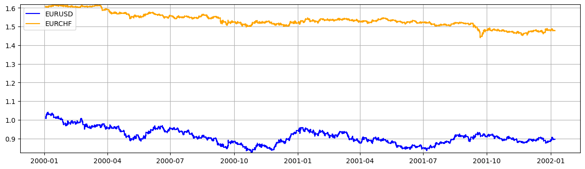
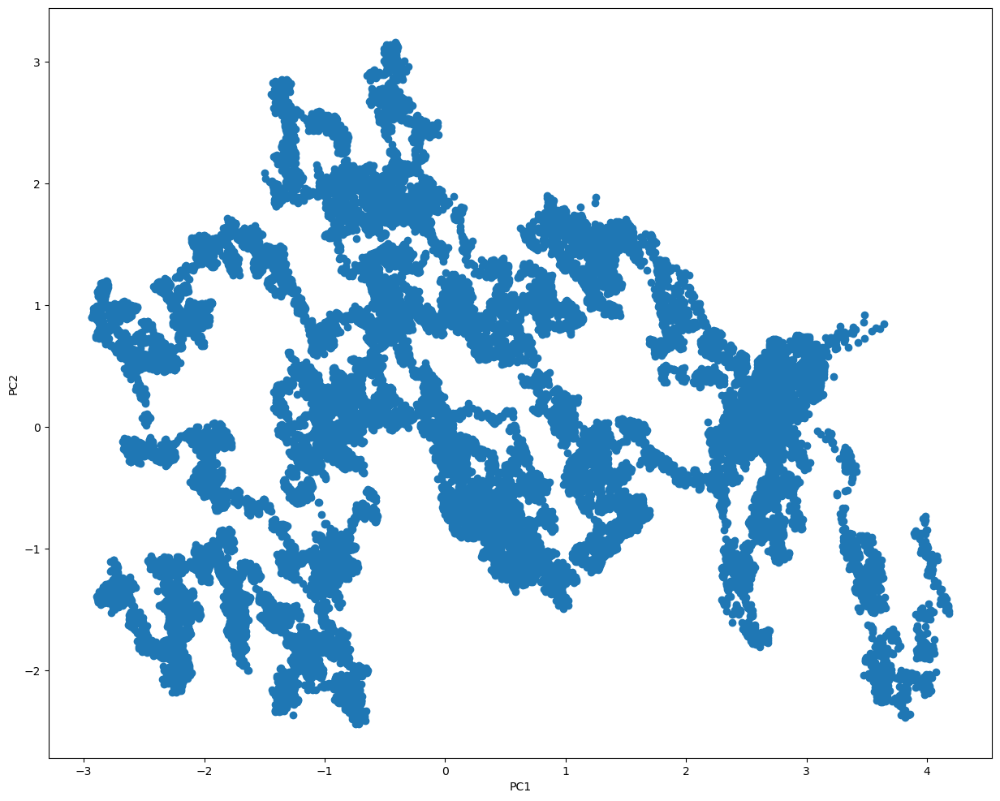
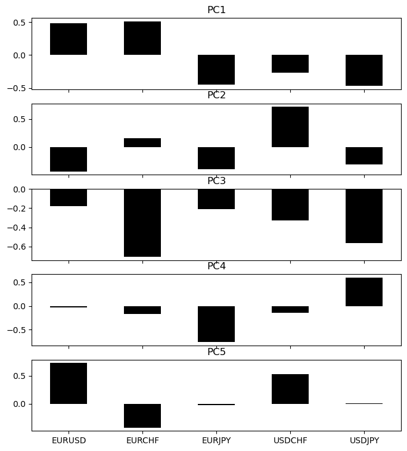
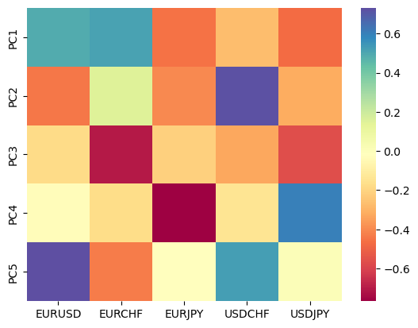
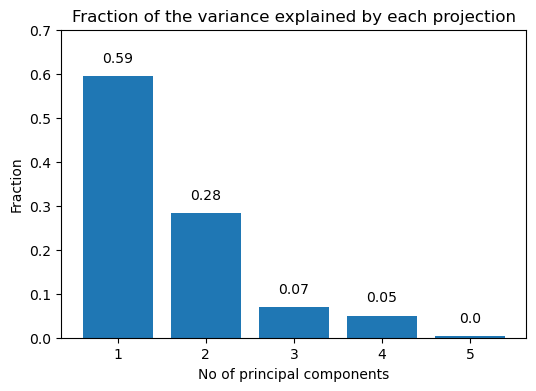
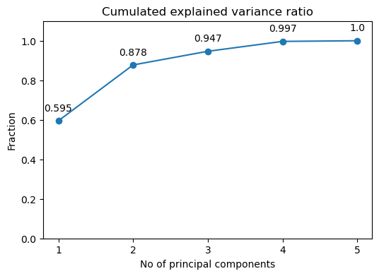
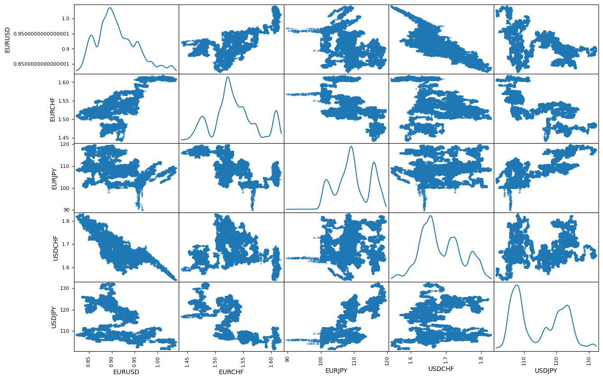
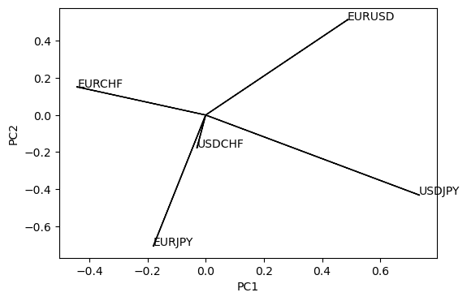
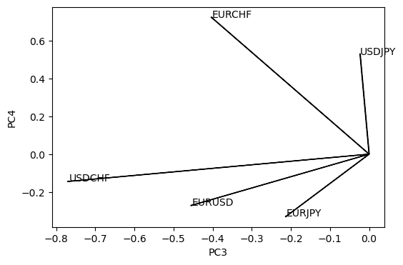

# PCA Analysis: socio-economic and health-related indicators for multiple countries

Dataset Overview

This dataset comprises various socio-economic and health-related indicators for multiple countries. The columns included are:

- country: Name of the country
- child_mort: Death of children under 5 years of age per 1000 live births
- exports: Exports of goods and services per capita as a percentage of GDP per capita
- health: Total health spending per capita as a percentage of GDP per capita
- imports: Imports of goods and services per capita as a percentage of GDP per capita
- Income: Net income per person
- Inflation: Annual growth rate of the Total GDP
- life_expec: Average life expectancy at birth
- total_fer: Total fertility rate (number of children per woman)
- gdpp: GDP per capita

1. **Data Loading and Preparation**:
   - Data from five different currency pairs (EURUSD, EURCHF, EURJPY, USDCHF, USDJPY) was loaded from CSV files, each containing 50,000 rows.
   - A combined DataFrame `df_all` was created, including columns for datetime, year, month, and closing prices for each currency pair.

2. **Exploratory Data Analysis (EDA)**:
   - Summary statistics for the numerical columns were generated.
   - Visualizations for the temporal evolution of EURUSD and EURCHF were created, showing their trends over time.

     

   - Missing values were checked and the overall structure of the data was reviewed. Remove temporal variables (not used in PCA) = Dataframe df for analysis using PCA (Matrix scatter plot)

     

     

----------
3. **Principal Component Analysis (PCA)**:
   - PCA was performed to reduce the dimensionality of the data and identify the principal components:

Plot the loads defining each principal component

Plot the loads but using a compact form

4. **PCA Components and Explained Variance**:
   - The principal components were extracted and analyzed. 
   - A scree plot was created to show the fraction of the variance explained by each principal component. This helps to determine the number of components to retain.
  

   - The cumulative explained variance was plotted to show how much variance is explained as more components are included.

Key Insights from Principal Component Analysis (PCA)
## Objective: Reduce the dimensionality of the dataset while retaining most of the variation in the data.
Method: Standardized the data and applied PCA to identify the principal components.

Principal Components:

PC1: This component captures the largest variance in the dataset. It is heavily influenced by indicators such as Income, exports, and gdpp. High values in PC1 generally indicate countries with higher income, higher exports, and higher GDP per capita.

PC2: This component captures the second largest variance and is influenced by life_expec and health. Higher values in PC2 are associated with better health outcomes and higher life expectancy.

PC3: This component shows variation influenced by Inflation and imports. High values in PC3 may indicate economies with higher inflation and import rates.

Explained Variance:

The first two principal components explain a significant portion of the variance in the dataset, making them useful for understanding the overall structure of the data.
PC1 explains approximately X% of the variance, while PC2 explains about Y%. Together, they capture a majority of the data's variability.

### Visualizations:

### Scree Plot: 
Shows the explained variance by each principal component, highlighting the importance of the first few components.

### Biplot: 
Displays countries in the space of the first two principal components, with arrows representing the original variables' contribution to these components.

PC1, PC2

PC3, PC4

### Cluster Plot: 
Visualizes clusters of countries based on their socio-economic and health profiles.
Country Clustering:

Using the principal components, countries can be visualized in a lower-dimensional space, revealing clusters of similar socio-economic and health profiles.
Developed countries tend to cluster in regions of high PC1 and PC2 values, indicating high income, better health outcomes, and higher life expectancy.
Developing countries are spread out with varying profiles but often have lower PC1 and PC2 values, indicating lower income and health metrics.

-----
### Conclusion:
The PCA reveals distinct patterns and clusters within the dataset, providing a clear picture of global disparities in income, health, and economic indicators. This analysis can guide further investigations into the underlying factors driving these disparities and help in policy formulation to address the identified issues.

### Key Findings

- **Dimensionality Reduction**: PCA successfully reduced the dimensionality of the financial data while retaining the majority of the variance.
- **Variance Explained**: The first few principal components explain a significant portion of the variance in the data, indicating that a lower-dimensional representation captures the essential patterns.
- **Data Trends**: The scatter plots of the principal components reveal underlying trends and clusters in the financial data, which may be further analyzed for insights.

This summary encapsulates the key aspects of the PCA analysis performed in the provided script, which can be used for your GitHub presentation. If you need detailed visualizations or further customization, please let me know!
